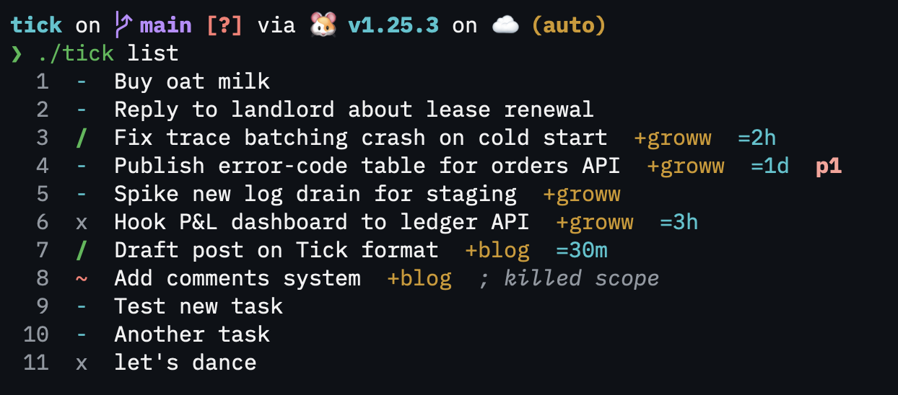

# Tick

A dead-simple, line-oriented task format for personal use.

## Format

One line = one task. No nesting, no indentation rules.

```
;tick:0.0.1

; grocery run
- :: Buy oat milk
- :: Call dentist

; work
/ =2h +groww #android :: Fix crash on cold start
x +groww #backend :: Ship API endpoint
~ +blog :: Add comments ; killed - not worth the spam
```

### Status

| Char | State |
|------|-------|
| `-`  | Todo |
| `/`  | Active |
| `x`  | Done |
| `~`  | Dropped |

### Syntax

```
<status> [p1|p2|p3] [=<duration>] [+<project>] [#tags...] :: <title> [; <note>]
```

- **Duration**: `=15m`, `=2h`, `=1d`, `=1w`
- **Project**: `+projectname`
- **Tags**: `#tag` anywhere in line
- **Mentions**: `@name` anywhere in line

## Install

```bash
go install sahebg.dev/tick@latest
```



## Usage

```bash
tick                          # list all tasks (default)
tick add "task description"   # add a new task with inline parsing
tick list                     # list tasks
tick list --project groww     # filter by project
tick list --tag backend       # filter by tag
tick list --status todo       # filter by status (-, /, x, ~)
tick list --priority p1       # filter by priority
tick done <id>                # mark task as done
tick done <id> --note "msg"   # mark done with a note
tick active <id>              # mark task as in progress
tick drop <id>                # soft-delete a task
```

Tasks are referenced by their numeric ID shown in `tick list`.

### Inline parsing for `tick add`

Metadata tokens can be placed anywhere in the task text:

```bash
tick add "Fix crash on cold start #android +groww p1"
tick add "=2h +blog :: Draft post"
```

Optional flags override inline values:

```bash
tick add "Write tests" --project backend --priority p1 --duration 30m
```

## Why

- Human readable at 2 AM
- Parser fits in 20 lines
- Order-agnostic tokens - shuffle without breaking parse
- Plain text - works with grep, sed, any editor